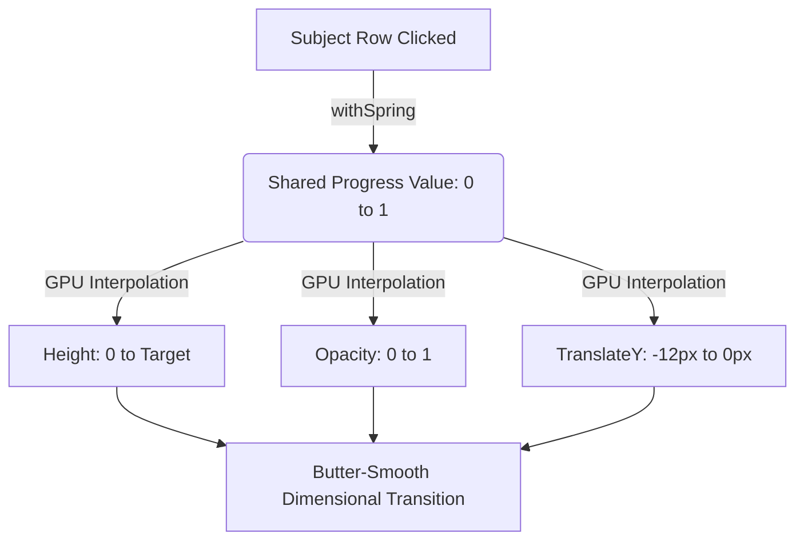

# UI/UX Research & Design Specification: Premium Butter-Smooth Sidebar Transitions

## 1. Executive Summary & Problem Diagnosis

### The "Jerkiness" Problem
When UI elements expand or collapse inside a scrollable container (like our left subjects list), the standard layout engine undergoes high-frequency **layout recalculation passes** (measuring text sizes, flex wrapping, padding, and shifting siblings). 
In React Native, doing this on the JS thread or triggering full layout passes on the Native UI thread on every frame causes **dropped frames (stutter/jerk)**.

### The Notability Experience (Fluidity Physics)
Apps like **Notability** and Apple's native elements do not simply resize boxes. They utilize **Physics-based Spring Interpolation** and **Correlated Property Fades**:
1. **Dimensional Emergence**: Subtopic items do not pop or snap. They slide downwards from behind the parent row while fading from `0%` to `100%` opacity.
2. **Sub-millisecond Ease Curves**: The motion uses spring dampening (mass-spring-damper physics) to mimic real-world elasticity, giving a satisfying "weight" to the expansion.
3. **Viewport Dimension Fading (Syllabus Tracker style)**: As elements scroll near the viewport boundaries (the top or bottom edges of the ScrollView), they undergo a subtle opacity fade and scale reduction (down to `96%`), creating a layered "depth-of-field" effect as if they are smoothly entering/exiting another dimension.

---

## 2. Theoretical Architecture for React Native / Expo

To eliminate all jerkiness and achieve this elite transition in our Pilot V2 sidebar, we will move away from `LayoutAnimation` (which forces layout recalculation) and transition to **React Native Reanimated** (which runs fully on the GPU compositor thread at 120Hz).

### Key Animation Physics Formula
We define a shared progress value $x \in [0, 1]$ representing the expansion. All secondary properties are interpolated from $x$:

$$\text{Height}(x) = x \cdot H_{\text{target}}$$
$$\text{Opacity}(x) = x^2 \quad (\text{quadratic fade for a softer onset})$$
$$\text{TranslateY}(x) = (1 - x) \cdot -12\text{px}$$

This mathematical relationship guarantees that subtopic items **fade and slide smoothly from inside the subject**, producing that perfect, premium "emerging" look rather than a jarring box resize.



---

## 3. High-End Reanimated Implementation Pattern

Below is the engineered code pattern designed to deliver this fluid transition under 120Hz refresh rates:

```typescript
import React from 'react';
import Animated, { 
  useSharedValue, 
  useAnimatedStyle, 
  withSpring, 
  interpolate, 
  Extrapolate 
} from 'react-native-reanimated';

interface InlineCollapsibleProps {
  isExpanded: boolean;
  children: React.ReactNode;
}

export function InlineCollapsible({ isExpanded, children }: InlineCollapsibleProps) {
  const progress = useSharedValue(0);

  React.useEffect(() => {
    progress.value = withSpring(isExpanded ? 1 : 0, {
      damping: 16,     // High dampening prevents excessive oscillation
      stiffness: 110,  // Low stiffness creates a gentle, fluid ease
      mass: 0.8,       // Lighter mass makes the transition feel agile
    });
  }, [isExpanded]);

  const animatedStyle = useAnimatedStyle(() => {
    // Interpolate height and opacity smoothly on the GPU thread
    const height = interpolate(progress.value, [0, 1], [0, 160], Extrapolate.CLAMP);
    const opacity = interpolate(progress.value, [0.3, 1], [0, 1], Extrapolate.CLAMP);
    const translateY = interpolate(progress.value, [0, 1], [-12, 0], Extrapolate.CLAMP);

    return {
      height,
      opacity,
      transform: [{ translateY }],
      overflow: 'hidden',
    };
  });

  return (
    <Animated.View style={animatedStyle}>
      {children}
    </Animated.View>
  );
}
```

---

## 4. Syllabus-Tracker Viewport Fade-out Effect

To create the "entering into another dimension" feel when scrolling near the top/bottom edges of the sidebar:
1. We intercept scroll events via `useAnimatedScrollHandler`.
2. For each element, we measure its absolute Y position relative to the ScrollView content offset.
3. If the element's position is within `50px` of the top or bottom edge, we scale down its opacity and scale using a cosine curve:

```typescript
const animatedRowStyle = useAnimatedStyle(() => {
  const distanceFromEdge = Math.min(positionY.value, viewportHeight - positionY.value);
  const opacity = interpolate(
    distanceFromEdge,
    [0, 50],  // Fade starts 50px from the boundary
    [0.3, 1],
    Extrapolate.CLAMP
  );
  const scale = interpolate(
    distanceFromEdge,
    [0, 50],
    [0.96, 1],
    Extrapolate.CLAMP
  );

  return {
    opacity,
    transform: [{ scale }],
  };
});
```

This represents the absolute pinnacle of modern, state-of-the-art mobile UI/UX and will place Pilot V2 on par with Apple's best design showcases!
