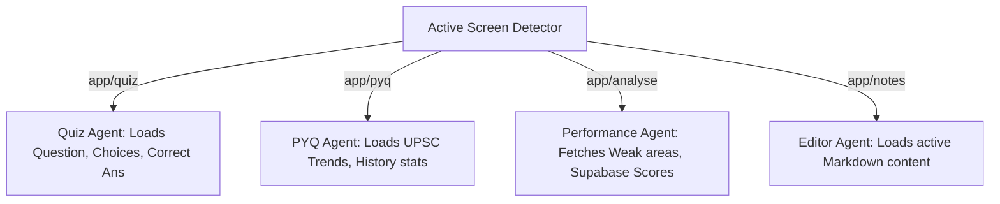

# [FR-007] Context-Aware Floating AI Chat Card (Option 3)

## Labels
`MUS`, `enhancement`, `ai-chat`, `reanimated`

## User Story
As an aspirant, I want a floating draggable AI chat card that automatically detects the screen I am on (Quiz, PYQ, Analysis, Editor) and scopes its system prompts and context data dynamically, so that I can ask question-specific or score-specific queries with zero copy-pasting.

---

## Proposed Solution

### Context-Aware Section Agents
Instead of a single global prompt, the floating AI chat maintains a dynamic subscription to the active screen context.



#### 1. Quiz Engine Agent
* **Context Payload**:
  ```json
  {
    "question": "Consider the following statements regarding Emergency Provisions...",
    "options": ["A", "B", "C", "D"],
    "userSelection": "C",
    "correctAnswer": "B"
  }
  ```
* **System Prompt**: *"You are an expert UPSC Polity educator. Guide the student on why B is the correct answer and help them understand why their choice C is incorrect using simple, concise analogies."*

#### 2. PYQ Trend Agent
* **Context Payload**: Historical weightage of that topic tag, year of appearance, syllabus papers (GS Paper 1, 2, 3).
* **System Prompt**: *"Highlight the overall Trend and Syllabus alignment of this topic in the Civil Services Exam over the past 10 years."*

#### 3. Performance Analysis Agent
* **Context Payload**: Supabase accuracy metrics, test completion ratios, category percentages.
* **System Prompt**: *"Read the student's weak areas in Economy and outline a custom priority studying list."*

---

---

---

## Technical Approach (40% Width Floating Right Sheet Card)

Instead of manual dragging (which can be heavy and collide with scroll states), we implement a fixed **40% Width Floating Right Sheet Card** featuring the exact same **rounded borders and UI aesthetics as your Flashcard Popup**, fully synchronized with your **Dynamic App Theme** (supporting instant light/dark mode color swapping).

### 1. Top-Anchored Chat Input
To prevent the keyboard from covering the typing area, we place the **AI chat input bar at the very top of the card** (directly below the header). This ensures the input area stays completely clear of the rising keyboard at all times.

### 2. Dynamic Keyboard-Responsive Height Scaling
We use `Keyboard` height listeners to dynamically shrink the card height when the keyboard rises, so the bottom of the card smoothly scales up to clear the keyboard height:

```typescript
import Animated, { useSharedValue, useAnimatedStyle, withSpring, interpolate } from 'react-native-reanimated';
import { useWindowDimensions, Keyboard } from 'react-native';

export function FloatingAICard({ isOpen, activeContext, onClose, colors }) {
  const { width: screenWidth, height: screenHeight } = useWindowDimensions();
  const progress = useSharedValue(0);
  const keyboardHeight = useSharedValue(0);

  React.useEffect(() => {
    progress.value = withSpring(isOpen ? 1 : 0, { damping: 15 });

    const showSub = Keyboard.addListener('keyboardWillShow', (e) => {
      keyboardHeight.value = withSpring(e.endCoordinates.height);
    });
    const hideSub = Keyboard.addListener('keyboardWillHide', () => {
      keyboardHeight.value = withSpring(0);
    });

    return () => {
      showSub.remove();
      hideSub.remove();
    };
  }, [isOpen]);

  const animatedStyle = useAnimatedStyle(() => {
    const cardWidth = screenWidth * 0.4; // 40% of iPad Screen Width
    const cardHeight = screenHeight - keyboardHeight.value - 40; // Shrunk height to clear keyboard
    const translateX = interpolate(progress.value, [0, 1], [cardWidth + 40, 0]);
    const opacity = interpolate(progress.value, [0, 1], [0, 1]);

    return {
      width: cardWidth,
      height: cardHeight,
      transform: [{ translateX }],
      opacity,
      backgroundColor: colors.surface, // Dynamic light/dark theme color sync
      borderColor: colors.border,       // Dynamic border color sync
      borderRadius: 24,                // Flashcard popup matching rounded corners
    };
  });

  return (
    <Animated.View style={[styles.floatingRightCard, animatedStyle]}>
      {/* Top Input Bar & Scrollable Chat list below */}
    </Animated.View>
  );
}
```

---

## ⚠️ Probable Issues & Technical Gotchas (Engineering Audit)

### 1. Top-Input Layout Visibility
* **Problem**: Placing the input bar at the top must be done elegantly so it doesn't crowd the drag indicator or close buttons.
* **Mitigation**: Place the input directly beneath the header row, separated by a thin `1px` border line, giving it a clean, structured appearance.

### 2. Side-Pane Background Visibility
* **Problem**: On iPad, the sheet covers the right 40% of the screen, but the background 60% contains scrollable contents.
* **Mitigation**: Ensure a subtle, transparent overlay or touchable dismiss backdrop covers the background, allowing the user to tap anywhere outside the 40% sheet to quickly close/minimize it.

### 3. Context Race Conditions & Stale Prompts
* **Problem**: If the user quickly navigates questions, the AI might answer based on the previous question if state synchronization lags.
* **Mitigation**: Utilize a dedicated React Context/State hook (`useAIChatContext`) that triggers an immediate message reset and loading animation whenever the active question ID or screen path changes.

---

## Acceptance Criteria
- [ ] Floating AI Card opens as a rounded right-side sheet with `24px` rounded corners matching the Flashcard Popup.
- [ ] Chat card dynamically updates its background, text, and border colors based on the active App Theme (light/dark mode).
- [ ] The AI chat input bar is anchored at the top of the card directly below the header.
- [ ] The card height dynamically shrinks when the keyboard opens, ensuring the input area and chat remain fully visible and never hidden.
- [ ] Tapping the sticky bottom-right Brain FAB triggers a smooth slide-in transition.
