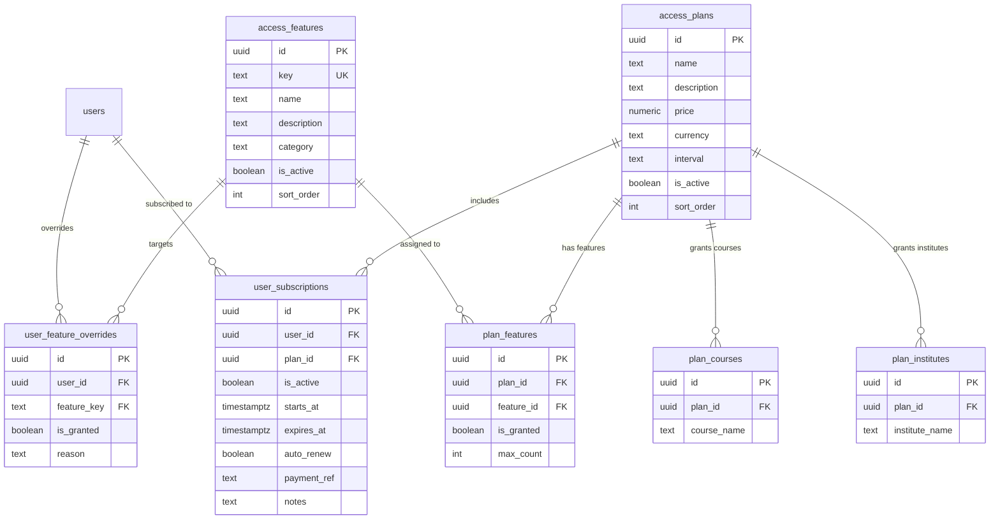

# Access Control & Subscription System — Architecture Plan

## Overview

A fully configurable, admin-driven access control system that gates every feature in the Dr. UPSC app behind **plans/tiers**. The admin can define features, create plans, assign features/institutes/courses to each plan, and assign users to plans — all from the admin panel UI. No hardcoded logic.

---

## 1. New Supabase Tables

### 1.1 `access_features` — Feature Catalog

Every gatable feature in the app is registered here. The admin creates/edits these from the panel.

```sql
CREATE TABLE access_features (
  id          uuid PRIMARY KEY DEFAULT gen_random_uuid(),
  key         text NOT NULL UNIQUE,          -- e.g. 'pyq', 'flashcards', 'analytics', 'notes', 'ai_search'
  name        text NOT NULL,                  -- e.g. 'Previous Year Questions'
  description text DEFAULT '',
  category    text NOT NULL DEFAULT 'feature', -- 'feature' | 'institute' | 'course' | 'test'
  is_active   boolean DEFAULT true,
  sort_order  integer DEFAULT 0,
  created_at  timestamptz DEFAULT now()
);
```

**Seed features** (pre-populated, editable in admin):

| Key | Name | Category |
|---|---|---|
| `pyq` | Previous Year Questions | feature |
| `flashcards` | Flashcards (Spaced Repetition) | feature |
| `analytics` | Analytics & Performance | feature |
| `notes` | Text Notes | feature |
| `soft_notes` | Soft Notes (Canvas) | feature |
| `hard_notes` | Hard Notes | feature |
| `ai_search` | AI Search | feature |
| `ai_settings` | AI Settings | feature |
| `capsules` | Study Capsules | feature |
| `tracker` | Study Tracker | feature |
| `quiz_arena` | Quiz Arena / Test Attempts | feature |
| `export_pdf` | PDF Export | feature |
| `revision` | Revision System | feature |
| `tags` | Tags & Categorization | feature |
| `pilot_v2` | Pilot V2 Features | feature |

### 1.2 `access_plans` — Subscription Plans

```sql
CREATE TABLE access_plans (
  id          uuid PRIMARY KEY DEFAULT gen_random_uuid(),
  name        text NOT NULL,                  -- 'Free', 'Pro Monthly', 'Pro Yearly', 'Premium', etc.
  description text DEFAULT '',
  price       numeric(10,2) DEFAULT 0,        -- For future billing integration
  currency    text DEFAULT 'INR',
  interval    text DEFAULT 'month',           -- 'month' | 'year' | 'lifetime' | 'one_time'
  is_active   boolean DEFAULT true,
  sort_order  integer DEFAULT 0,
  created_at  timestamptz DEFAULT now()
);
```

### 1.3 `plan_features` — Feature-to-Plan Mapping

Links features to plans with optional limits.

```sql
CREATE TABLE plan_features (
  id          uuid PRIMARY KEY DEFAULT gen_random_uuid(),
  plan_id     uuid NOT NULL REFERENCES access_plans(id) ON DELETE CASCADE,
  feature_id  uuid NOT NULL REFERENCES access_features(id) ON DELETE CASCADE,
  is_granted  boolean DEFAULT true,           -- true = included, false = explicitly excluded
  max_count   integer,                        -- optional: max uses (e.g. 50 PYQs/month)
  UNIQUE(plan_id, feature_id)
);
```

### 1.4 `plan_institutes` — Institute Access per Plan

Controls which coaching institutes' tests a plan grants access to.

```sql
CREATE TABLE plan_institutes (
  id              uuid PRIMARY KEY DEFAULT gen_random_uuid(),
  plan_id         uuid NOT NULL REFERENCES access_plans(id) ON DELETE CASCADE,
  institute_name  text NOT NULL,              -- e.g. 'VisionIAS', 'Vajiram & Ravi'
  UNIQUE(plan_id, institute_name)
);
```

### 1.5 `plan_courses` — Course Access per Plan

Controls which courses a plan grants access to.

```sql
CREATE TABLE plan_courses (
  id           uuid PRIMARY KEY DEFAULT gen_random_uuid(),
  plan_id      uuid NOT NULL REFERENCES access_plans(id) ON DELETE CASCADE,
  course_name  text NOT NULL,                 -- e.g. 'UPSC CSE Prelims 2025', 'UPSC CSE Mains'
  UNIQUE(plan_id, course_name)
);
```

### 1.6 `user_subscriptions` — User-to-Plan Assignment

```sql
CREATE TABLE user_subscriptions (
  id              uuid PRIMARY KEY DEFAULT gen_random_uuid(),
  user_id         uuid NOT NULL REFERENCES users(id) ON DELETE CASCADE,
  plan_id         uuid NOT NULL REFERENCES access_plans(id),
  is_active       boolean DEFAULT true,
  starts_at       timestamptz DEFAULT now(),
  expires_at      timestamptz,                -- NULL = never expires (lifetime / manual)
  auto_renew      boolean DEFAULT false,
  payment_ref     text,                       -- For future billing integration
  notes           text DEFAULT '',
  created_at      timestamptz DEFAULT now(),
  updated_at      timestamptz DEFAULT now()
);

CREATE INDEX idx_user_subscriptions_user ON user_subscriptions(user_id);
CREATE INDEX idx_user_subscriptions_active ON user_subscriptions(user_id, is_active);
```

### 1.7 `user_feature_overrides` — Per-User Feature Overrides

For granting/revoking individual features outside of plans.

```sql
CREATE TABLE user_feature_overrides (
  id           uuid PRIMARY KEY DEFAULT gen_random_uuid(),
  user_id      uuid NOT NULL REFERENCES users(id) ON DELETE CASCADE,
  feature_key  text NOT NULL REFERENCES access_features(key),
  is_granted   boolean NOT NULL,             -- true = force grant, false = force revoke
  reason       text DEFAULT '',
  created_at   timestamptz DEFAULT now(),
  UNIQUE(user_id, feature_key)
);
```

---

## 2. Architecture — How Access Check Works

```
User logs into app
       │
       ▼
Fetch user's active subscription (user_subscriptions)
       │
       ▼
Resolve effective permissions:
  1. Start with plan's features (plan_features)
  2. Apply overrides (user_feature_overrides) — overrides win
       │
       ▼
Cache permissions in-memory (Zustand store / context)
       │
       ▼
Each feature checks: "does current user have access?"
  ├─ If YES → show feature
  └─ If NO  → show "Upgrade" upsell screen or hide the button
```

---

## 3. Admin Panel — New Page Architecture

### 3.1 New Route: `/access-control`

Add to [`NAV_ITEMS`](admin-panel/src/lib/constants.ts:71) in constants:
```ts
{ key: 'access-control', label: 'Access Control', icon: 'ShieldCheck' },
// Restricted to super_admin only
```

### 3.2 Sub-pages (tabs within Access Control)

#### Tab 1: 🏷️ Features Manager
- List all features in `access_features` table
- CRUD: Add new feature, edit name/description/category, toggle active/inactive
- Visual: Table with columns: Key, Name, Category, Active, Sort Order, Actions (Edit, Toggle)

#### Tab 2: 📋 Plans Manager
- List all plans in `access_plans` table
- CRUD: Create plan (name, description, price, interval), toggle active
- Click into a plan to configure:
  - **Features tab**: Checkbox list of all features — check = included in plan, uncheck = excluded
  - **Institutes tab**: Multi-select list of institutes (from distinct `tests.institute` values)
  - **Courses tab**: Multi-select list of courses (from distinct `tests.course` values)

#### Tab 3: 👥 User Subscriptions
- Table listing all users with their current subscription info
- Columns: User, Email, Current Plan, Status (Active/Expired), Expires, Actions
- Click a user → subscription detail modal:
  - Select plan from dropdown
  - Set start/expiry dates
  - Toggle active/inactive
  - Add notes
- **Bulk assign**: Select multiple users → assign plan

#### Tab 4: ⚡ Feature Overrides
- Table of all per-user overrides
- Add override: Search user → select feature → grant/revoke → add reason
- Visual: User, Feature, Granted/Revoked, Reason, Created At, Actions

---

## 4. Mobile App Changes

### 4.1 New: `useAccessControl` hook (or `AccessControlContext`)

A new context/hook that:
1. Fetches the user's active subscription + features on app start
2. Caches permissions in-memory via Zustand
3. Exposes `hasAccess(featureKey: string): boolean`
4. Also exposes `hasInstituteAccess(institute: string): boolean` and `hasCourseAccess(course: string): boolean`

### 4.2 Feature Gates

Each gated feature needs a wrapper component or conditional:

```tsx
// Usage example:
const { hasAccess } = useAccessControl();

// In a screen:
{hasAccess('pyq') ? <PYQScreen /> : <UpgradeBanner feature="PYQs" />}
```

Create a reusable `<FeatureGate feature="pyq" fallback={<UpgradeBanner />}>` component.

### 4.3 Screens that need gating

| Screen/Route | Feature Key |
|---|---|
| [`app/pyq.tsx`](app/pyq.tsx) | `pyq` |
| [`app/flashcards.tsx`](app/flashcards.tsx) | `flashcards` |
| [`app/analytics.tsx`](app/analytics.tsx) | `analytics` |
| [`app/notes/`](app/notes/) | `notes` |
| [`app/softnotes/`](app/softnotes/) | `soft_notes` |
| [`app/hardnotes/`](app/hardnotes/) | `hard_notes` |
| [`app/ai-search.tsx`](app/ai-search.tsx) | `ai_search` |
| [`app/ai-settings.tsx`](app/ai-settings.tsx) | `ai_settings` |
| [`app/capsule/`](app/capsule/) | `capsules` |
| [`app/tracker.tsx`](app/tracker.tsx) | `tracker` |
| [`app/unified/arena.tsx`](app/unified/arena.tsx) | `quiz_arena` |
| [`app/(tabs)/revise.tsx`](app/(tabs)/revise.tsx) | `revision` |
| [`app/tags.tsx`](app/tags.tsx) | `tags` |
| [`app/pilot-v2/`](app/pilot-v2/) | `pilot_v2` |

### 4.4 Test/Institute/Course Gates

When fetching the list of available tests, filter by:
- `hasInstituteAccess(test.institute)` 
- `hasCourseAccess(test.course)`

If a user tries to access a test directly via URL, check access server-side before loading.

---

## 5. Implementation Order

### Phase 1: Database & Admin Panel (Backend-first)

1. Create new Supabase migration with all 6 tables
2. Seed initial features & a default "Free" plan
3. Build Admin Panel Access Control page with 4 tabs
4. Build Plans + Features CRUD UI
5. Build User Subscription management UI
6. Build Feature Override UI

### Phase 2: Mobile App (Frontend)

1. Create `AccessControlContext` / `useAccessControl` hook
2. Create `<FeatureGate>` component with upgrade upsell UI
3. Gate all feature screens
4. Gate test/institute/course access at the list level
5. Cache permissions locally for offline use

### Phase 3: Polish & Edge Cases

1. Handle expired subscriptions (grace period, remove access)
2. Admin notification when trial/subscription ends
3. Bulk import/export of subscription assignments
4. Audit log of access changes

---

## 6. Entity Relationship Diagram



---

## 7. Security Considerations

- Row-Level Security (RLS) on all new tables
  - `access_features`, `access_plans`, `plan_features`, `plan_institutes`, `plan_courses`: PUBLIC read (so the app can check permissions), super_admin write
  - `user_subscriptions`: User can read own, super_admin read/write all
  - `user_feature_overrides`: User can read own, super_admin read/write all
- The mobile app should never trust client-side checks alone — critical operations should verify server-side via Supabase RPC
- Admin panel pages restricted to `super_admin` role only
