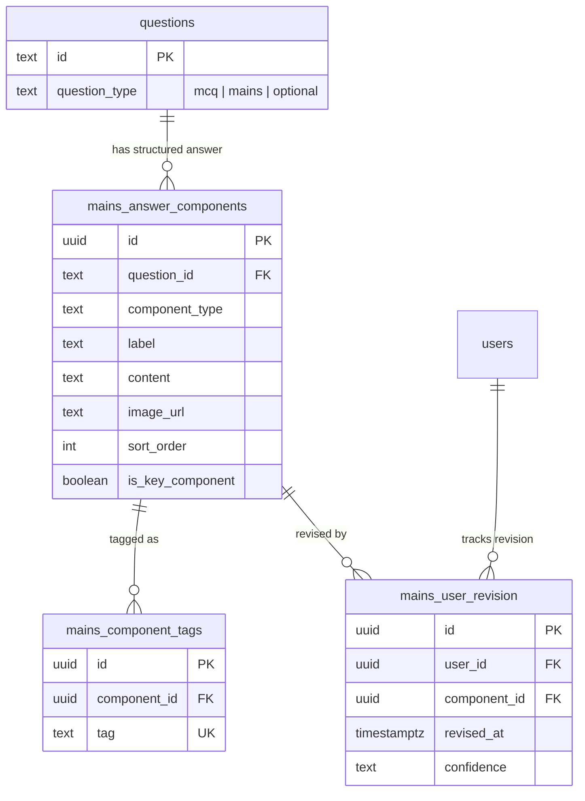

# Mains & Optional Subject System — Architecture Plan

## Core Philosophy

The user **does NOT write full answers**. Instead, they use the app for **structured revision** of Mains answer components. Each Mains question's answer is broken into reusable building blocks that can be filtered, studied, and revised independently.

---

## 1. Key Concepts

### 1.1 Mains Question != Prelims Question

| Aspect | Prelims (MCQ) | Mains (Subjective) |
|---|---|---|
| Answer type | A/B/C/D | Structured essay components |
| Options | 4 choices | None |
| Correct answer | Single letter | Not applicable |
| Answer structure | None | Intro / Body / Conclusion / Value-add / Diagram |
| Evaluation | Auto-graded | Self / AI / Manual |
| Study approach | Solve & score | **Revise components** |

### 1.2 Answer Components (Flexible per Question)

Each Mains question stores its "model answer" as an array of **named components**:

```json
[
  { "type": "introduction",  "content": "India's federal structure...", "markdown": true },
  { "type": "body",          "content": "Article 1 of the Constitution...", "markdown": true },
  { "type": "body_para_2",   "content": "...", "markdown": true },
  { "type": "value_addition", "content": "As per 2023 Economic Survey...", "markdown": true },
  { "type": "diagram",       "content": "", "markdown": true, "image_url": null },
  { "type": "conclusion",    "content": "Thus, federalism in India...", "markdown": true }
]
```

**Component types are flexible** — admin defines them per question. Common types:
- `introduction` — Opening paragraph
- `body` — Main arguments
- `body_para_N` — Multiple body paragraphs
- `value_addition` — Data, reports, committees, case laws
- `diagram` — Flowchart/diagram image or markdown
- `conclusion` — Closing paragraph
- `keyword` — Key terms/definitions
- `quote` — Relevant quotes
- `data_point` — Statistics/data points

---

## 2. Database Changes

### 2.1 New Column on `questions` table

```sql
ALTER TABLE questions ADD COLUMN question_type text DEFAULT 'mcq'
  CHECK (question_type IN ('mcq', 'mains', 'optional'));
```

### 2.2 New Table: `mains_answer_components`

```sql
CREATE TABLE mains_answer_components (
  id              uuid PRIMARY KEY DEFAULT gen_random_uuid(),
  question_id     text NOT NULL REFERENCES questions(id) ON DELETE CASCADE,
  component_type  text NOT NULL,     -- 'introduction', 'body', 'conclusion', 'value_addition', 'diagram', 'keyword', 'data_point', 'quote', etc.
  label           text DEFAULT '',   -- e.g. "Introduction", "Body Para 1", "Key Data"
  content         text NOT NULL DEFAULT '',  -- Markdown content
  image_url       text,             -- For diagram/image components
  sort_order      integer DEFAULT 0,
  is_key_component boolean DEFAULT false,  -- Flag for "must-know" parts
  created_at      timestamptz DEFAULT now(),
  updated_at      timestamptz DEFAULT now()
);

CREATE INDEX idx_mac_question ON mains_answer_components(question_id);
CREATE INDEX idx_mac_type ON mains_answer_components(component_type);
```

### 2.3 New Table: `mains_question_tags`

For tagging components across subjects (e.g., "all diagrams of Polity"):

```sql
CREATE TABLE mains_component_tags (
  id              uuid PRIMARY KEY DEFAULT gen_random_uuid(),
  component_id    uuid NOT NULL REFERENCES mains_answer_components(id) ON DELETE CASCADE,
  tag             text NOT NULL,     -- e.g. 'diagram', 'polity', 'value_addition', 'data_2023'
  UNIQUE(component_id, tag)
);
```

### 2.4 New Table: `mains_user_revision`

Tracks which components a user has revised:

```sql
CREATE TABLE mains_user_revision (
  id              uuid PRIMARY KEY DEFAULT gen_random_uuid(),
  user_id         uuid NOT NULL REFERENCES users(id) ON DELETE CASCADE,
  component_id    uuid NOT NULL REFERENCES mains_answer_components(id) ON DELETE CASCADE,
  revised_at      timestamptz DEFAULT now(),
  confidence      text DEFAULT 'medium'  -- 'low', 'medium', 'high'
  UNIQUE(user_id, component_id)
);
```

---

## 3. Feature Map: What Users Can Do

### 3.1 In Arena: Prelims ↔ Mains Switcher

The top of the Arena setup screen gets a **mode toggle**:

```
┌──────────────────────────────────────────┐
│  [PRELIMS ○ ● MAINS]  [ALL ○ GS ○ OPTIONAL] │
│                                           │
│  Subject: [Polity ▼]                      │
│  Topics: [Constitution ▼]                │
│                                           │
│  [Start Mains Revision Session]          │
└──────────────────────────────────────────┘
```

- **Prelims mode** = Existing MCQ flow (unchanged)
- **Mains mode** = Shows questions one at a time with:
  - The question prompt
  - Expandable answer components below
  - "Mark as Revised" button with confidence level
  - "Show Model Answer" toggle

### 3.2 Component Browser (NEW Screen)

A dedicated screen accessed from the tabs or from within Arena:

```
┌──────────────────────────────────────────┐
│  BACK                COMPONENT BROWSER   │
├──────────────────────────────────────────┤
│  Filter: [All Types ▼] [Subject ▼]      │
│  [Topic ▼] [Search...]                   │
├──────────────────────────────────────────┤
│  ┌──────────────────────────────────────┐│
│  │ ☐ Introduction  (24 saved)  [View]  ││
│  │ ☐ Body          (52 saved)  [View]  ││
│  │ ☐ Conclusion    (24 saved)  [View]  ││
│  │ ☐ Diagrams      (18 saved)  [View]  ││
│  │ ☐ Value Add     (31 saved)  [View]  ││
│  │ ☐ Keywords       (9 saved)  [View]  ││
│  │ ☐ Data Points   (14 saved)  [View]  ││
│  └──────────────────────────────────────┘│
│                                           │
│  Selected: Diagram ▼ | Polity ▼           │
│  ┌──────────────────────────────────────┐│
│  │ 📊 Centre-State Financial Relations ││
│  │    Diagram showing tax devolution... ││
│  ├──────────────────────────────────────┤│
│  │ 📊 Organs of Government             ││
│  │    Diagram: Legislature, Executive...││
│  ├──────────────────────────────────────┤│
│  │ 📊 Amendment Procedure              ││
│  │    Flowchart of constitutional...   ││
│  └──────────────────────────────────────┘│
└──────────────────────────────────────────┘
```

**Key capabilities:**
- Filter by **component type** (all diagrams, all intros, all conclusions)
- Filter by **subject** / **topic** / **tag**
- Search within component text
- View all diagrams of Polity at one glance
- View all introductions of GS1 together
- Add components to flashcards
- "Revise" button to track what you've studied

### 3.3 Mains Question Card (in Arena/Review)

Each Mains question displays as:

```
┌──────────────────────────────────────────┐
│  🔖 MAINS | Polity | GS2                │
│                                          │
│  Q: "Discuss the federal structure of   │
│      India with reference to recent     │
│      judicial pronouncements."          │
│                                          │
│  ─── Model Answer ───                    │
│  [+ Introduction]  ▼                    │
│    India's federal structure is unique...│
│                                          │
│  [+ Body]          ▼                    │
│    Article 1 describes India as a...     │
│                                          │
│  [+ Diagram]       ▶ [Tap to expand]    │
│                                          │
│  [+ Value Addition] ▶ [Tap to expand]   │
│                                          │
│  [+ Conclusion]    ▶ [Tap to expand]    │
│                                          │
│  ─────────────────────────────────────  │
│  [📌 Save to Notes] [🏷 Add to Flashcard] │
│  [✓ Mark Revised] [⭐ Bookmark]          │
└──────────────────────────────────────────┘
```

### 3.4 Quick Actions from Any Component

From any expanded component, user can:
- **📌 Save to Notes** — Copies content into user_notes
- **🏷 Add to Flashcard** — Creates a flashcard from the component
- **📋 Copy** — Copy to clipboard
- **🔍 Search Similar** — Find similar components across subjects
- **⭐ Bookmark** — Save for later

---

## 4. New Mobile App Screens

| Screen | Route | Purpose |
|---|---|---|
| **Mains Arena** | [`app/unified/mains-arena.tsx`](app/unified/arena.tsx) (or new) | Mains question browser with filter/expand/revise |
| **Component Browser** | [`app/mains/components.tsx`](app/) | Browse/filter all components by type, subject, tag |
| **Component Detail** | [`app/mains/component/[id].tsx`](app/) | Full view of a single component with actions |
| **Diagram Gallery** | [`app/mains/diagrams.tsx`](app/) | Grid view of all diagrams (by subject/filter) |
| **Revision Tracker** | [`app/mains/revision.tsx`](app/) | Shows progress on Mains revision by subject |

### 4.1 Route Architecture

```
app/
├── (tabs)/
│   └── index.tsx          ← Add Mains shortcut/dashboard widget
├── unified/
│   ├── arena.tsx          ← Add Prelims/Mains toggle
│   └── mains-arena.tsx    ← Mains-specific question flow
└── mains/
    ├── _layout.tsx
    ├── index.tsx          ← Mains Hub / Dashboard
    ├── components.tsx     ← Component Browser
    ├── component/[id].tsx ← Component Detail
    ├── diagrams.tsx       ← Diagram Gallery
    └── revision.tsx       ← Revision Progress
```

---

## 5. Admin Panel Changes

### 5.1 Question Editor Enhancement

When editing/creating a question in the admin panel, add a **Question Type** dropdown:
- `mcq` (default, existing)
- `mains` (show Mains answer builder)
- `optional` (same as mains but tagged as optional subject)

When `mains` or `optional` is selected, show a **Answer Component Builder**:

```
┌──────────────────────────────────────────────┐
│  Question Type: [MAINS ▼]                     │
│                                                │
│  ── Answer Components ──                       │
│  [+ Add Component]                             │
│                                                │
│  ┌─ Component 1 ─────────────────────────────┐ │
│  │  Type: [introduction ▼]                    │ │
│  │  Label: Introduction                       │ │
│  │  Is Key: [✓]                               │ │
│  │  Content: [Rich Text / Markdown Editor...] │ │
│  │  ┌──────────────────────────────────────┐  │ │
│  │  │ India's federal structure is...      │  │ │
│  │  └──────────────────────────────────────┘  │ │
│  │  [🗑 Remove] [↑ Move Up] [↓ Move Down]    │ │
│  └────────────────────────────────────────────┘ │
│  ┌─ Component 2 ─────────────────────────────┐ │
│  │  Type: [diagram ▼]                        │ │
│  │  Label: Federal Structure Diagram         │ │
│  │  Image: [Upload] [Paste URL]             │ │
│  │  Caption: Flowchart of Centre-State...    │ │
│  └────────────────────────────────────────────┘ │
└──────────────────────────────────────────────┘
```

### 5.2 Component Type Manager

In the admin panel, a new page to manage available component types:
- `introduction`, `body`, `conclusion`, `value_addition`, `diagram`, etc.
- Add custom types per question
- Set display icons and colors

---

## 6. Revision-Focused Features

### 6.1 Smart Revision by Component

Users can revise by **component type across subjects**:
- "Revise all **diagrams** of Polity today"
- "Review all **introductions** of GS1 this week"
- "Study all **value additions** tagged with 'Economic Survey 2023'"

### 6.2 Spaced Repetition for Components

Each component can be added to the flashcard system for spaced repetition:
- `Add to Flashcard` button on any component
- Creates a card with the component as front text
- Follows existing SM-2 algorithm

### 6.3 Component Collections

Users can create **collections** (playlists) of components:
- "Polity Diagrams for Revision"
- "GS3 Value Additions"
- "My Weak Introductions"

---

## 7. Implementation Order

### Phase 1: Database Foundation
1. Add `question_type` column to `questions` table
2. Create `mains_answer_components` table
3. Create `mains_component_tags` table  
4. Create `mains_user_revision` table
5. Update existing seed data for existing Mains questions

### Phase 2: Admin Panel
1. Update QuestionsPage with Question Type selector
2. Build Answer Component Builder (add/edit/reorder components)
3. Build Component Type manager

### Phase 3: Mobile App — Arena Mode
1. Add Prelims/Mains toggle to Arena setup
2. Build Mains Arena screen (question list with expandable components)
3. Build Mains Question Card component

### Phase 4: Mobile App — Component Browser
1. Build Component Browser screen with filters
2. Build Diagram Gallery
3. Build Component Detail screen
4. Add "Save to Notes" and "Add to Flashcard" integration

### Phase 5: Revision System
1. Build Revision Tracker screen
2. Build component collections
3. Integrate components with spaced repetition

---

## 8. Entity Relationship


