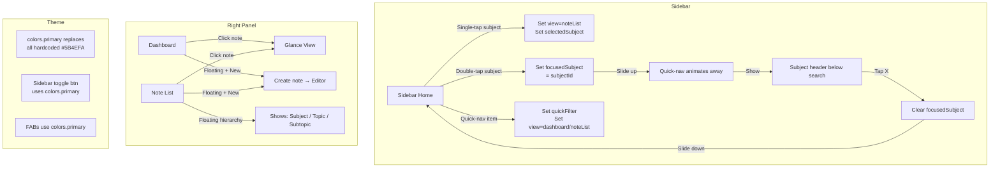

# Pilot V2 Sidebar Navigation & UX Redesign — Implementation Plan

## Overview

**13 distinct changes** across **7 files** (+1 new file). Each change is isolated and independently testable.

---

## File-by-File Change Summary

| File | Changes |
|------|---------|
| `src/components/pilot-v2/types.ts` | `focusedSubject` already present ✅ — Extract `iconForSubject()` here |
| `src/context/PilotV2Context.tsx` | Add missing `SET_FOCUSED_SUBJECT` reducer case; clear `focusedSubject` on `SET_SELECTED_SUBJECT` |
| `src/components/pilot-v2/usePilotV2DoubleTap.ts` | **NEW** — Reusable 300ms double-tap hook |
| `src/components/pilot-v2/PilotV2Sidebar.tsx` | Focused Subject Mode UI, purple→gray highlights, navigation state fix |
| `src/components/pilot-v2/PilotV2SidebarSubject.tsx` | Purple→gray highlights, use `iconForSubject()` from types |
| `src/components/pilot-v2/PilotV2Dashboard.tsx` | Remove fixed top bar → greeting scrolls naturally; theme colors for New button |
| `src/components/pilot-v2/PilotV2NoteList.tsx` | Remove breadcrumb, remove "Notes" title, remove back button, add floating hierarchy bar, theme colors |
| `src/components/pilot-v2/PilotV2GlanceView.tsx` | Theme color for sidebar toggle button |
| `app/pilot-v2/index.tsx` | Theme color for sidebar toggle floating button |

---

## Step 1: Add Missing `SET_FOCUSED_SUBJECT` Reducer Case

**File:** [`src/context/PilotV2Context.tsx`](src/context/PilotV2Context.tsx)

**Current state:** Line 39 defines `SET_FOCUSED_SUBJECT` in the action union, but **no corresponding `case` in the reducer**.

### 1a — Add reducer case (after line 111)

```typescript
case 'SET_FOCUSED_SUBJECT':
  return {
    ...state,
    view: { ...state.view, focusedSubject: action.payload },
  };
```

### 1b — Clear `focusedSubject` on subject switch (lines 78-87)

When the user selects a different subject, exiting Focused Mode makes sense:

```typescript
case 'SET_SELECTED_SUBJECT':
  return {
    ...state,
    view: {
      ...state.view,
      selectedSubject: action.payload,
      selectedTopic: null,
      selectedSubtopic: null,
      focusedSubject: null,  // ← ADD THIS
    },
  };
```

---

## Step 2: Extract `iconForSubject()` to Shared Utility

**File:** [`src/components/pilot-v2/types.ts`](src/components/pilot-v2/types.ts)

Move `iconForSubject` from `PilotV2Sidebar.tsx` to `types.ts` to avoid circular imports.

Add after line 228:
```typescript
/** Map a subject label to the best-matching icon key. */
export function iconForSubject(label: string): string {
  const lc = label.toLowerCase().replace(/[^a-z]/g, '');
  if (lc.includes('polit') || lc.includes('law') || lc.includes('constitut') || lc.includes('govern')) return 'Landmark';
  if (lc.includes('econom') || lc.includes('finance') || lc.includes('budget') || lc.includes('market')) return 'TrendingUp';
  if (lc.includes('history') || lc.includes('ancient') || lc.includes('medieval') || lc.includes('modern')) return 'ScrollText';
  if (lc.includes('geograph') || lc.includes('map') || lc.includes('environ') || lc.includes('ecology')) return 'Globe2';
  if (lc.includes('scienc') || lc.includes('tech') || lc.includes('space') || lc.includes('biotech')) return 'FlaskConical';
  if (lc.includes('ethic') || lc.includes('philosoph') || lc.includes('moral') || lc.includes('integrity')) return 'Scale';
  if (lc.includes('sociolog') || lc.includes('culture') || lc.includes('art') || lc.includes('religion')) return 'Leaf';
  return 'Book';
}
```

**Also update imports:**
- [`PilotV2Sidebar.tsx`](src/components/pilot-v2/PilotV2Sidebar.tsx): Remove local `iconForSubject`, import from `'./types'`
- [`PilotV2SidebarSubject.tsx`](src/components/pilot-v2/PilotV2SidebarSubject.tsx): Import `iconForSubject` from `'./types'`

---

## Step 3: Create `usePilotV2DoubleTap` Hook

**File:** [`src/components/pilot-v2/usePilotV2DoubleTap.ts`](src/components/pilot-v2/usePilotV2DoubleTap.ts) **(NEW)**

```typescript
import { useRef, useCallback } from 'react';

const DOUBLE_TAP_DELAY = 300; // ms

export function usePilotV2DoubleTap(
  onSingleTap: () => void,
  onDoubleTap: () => void,
) {
  const lastKeyRef = useRef<string | null>(null);
  const lastTapRef = useRef<number>(0);

  return useCallback(
    (key: string) => {
      const now = Date.now();
      const isDoubleTap =
        key === lastKeyRef.current &&
        now - lastTapRef.current < DOUBLE_TAP_DELAY;

      lastKeyRef.current = key;
      lastTapRef.current = now;

      if (isDoubleTap) {
        onDoubleTap();
      } else {
        onSingleTap();
      }
    },
    [onSingleTap, onDoubleTap],
  );
}
```

---

## Step 4: Focused Subject Mode UI in Sidebar (Home mode)

**File:** [`src/components/pilot-v2/PilotV2Sidebar.tsx`](src/components/pilot-v2/PilotV2Sidebar.tsx)

### 4a — Import the double-tap hook + iconForSubject

```typescript
import { usePilotV2DoubleTap } from './usePilotV2DoubleTap';
import { iconForSubject } from './types'; // instead of local function
```

### 4b — Animated quick-nav

Wrap the quick-nav section (lines 808-815):

```typescript
const quickNavAnim = useAnimatedStyle(() => {
  const translateY = withSpring(focusedSubject ? -120 : 0, {
    damping: 20, stiffness: 200, mass: 0.5, overshootClamping: true,
  });
  const opacity = withSpring(focusedSubject ? 0 : 1, {
    damping: 20, stiffness: 200, mass: 0.5,
  });
  return {
    transform: [{ translateY }],
    opacity,
    height: focusedSubject ? 0 : undefined,
    overflow: 'hidden',
  };
});

<AnimatedReanimated.View style={quickNavAnim}>
  <View style={{ paddingHorizontal: 12, paddingBottom: 8, paddingTop: 4 }}>
    <NavRow ... />...
  </View>
</AnimatedReanimated.View>
```

### 4c — Focused subject header (below search bar)

```typescript
{focusedSubject && activeSubjectMeta && (
  <View style={{ paddingHorizontal: 16, paddingVertical: 8 }}>
    <View style={{ flexDirection: 'row', alignItems: 'center', gap: 10 }}>
      <View style={[styles.subjectIcon, { backgroundColor: activeSubjectMeta.bg }]}>
        {React.createElement(
          SUBJECT_ICONS[iconForSubject(activeSubjectMeta.label)] || Book,
          { size: 16, color: activeSubjectMeta.text },
        )}
      </View>
      <Text style={{ fontSize: 18, fontWeight: '700', color: colors.textPrimary }}>
        {activeSubjectMeta.label}
      </Text>
      <TouchableOpacity
        onPress={() => dispatch({ type: 'SET_FOCUSED_SUBJECT', payload: null })}
        style={{ marginLeft: 'auto', padding: 4 }}
      >
        <X size={16} color={colors.textTertiary} />
      </TouchableOpacity>
    </View>
  </View>
)}
```

### 4d — Filter subjects list

```typescript
{subjectsList
  .filter(s => !focusedSubject || s.id === focusedSubject)
  .map((s, idx) => ( ... ))}
```

### 4e — Wire double-tap on subject rows

Pass `onSubjectTap` prop through `CollapsibleSubjectItem`. In `handleSelectSubject`, use the hook:

```typescript
const subjectTapHandler = usePilotV2DoubleTap(
  () => handleSelectSubject(subjectId),  // single tap = navigate
  () => {                                  // double tap = toggle focus
    if (state.view.focusedSubject === subjectId) {
      dispatch({ type: 'SET_FOCUSED_SUBJECT', payload: null });
    } else {
      dispatch({ type: 'SET_FOCUSED_SUBJECT', payload: subjectId });
    }
  },
);
```

---

## Step 5: Remove Purple Selection Highlights

Replace `#EEECFF` (purple tint) and `#5B4EFA` (purple text) with neutral grays.

### 5a — [`PilotV2Sidebar.tsx`](src/components/pilot-v2/PilotV2Sidebar.tsx)

| Approx Line | Current | Replace With |
|-------------|---------|--------------|
| 140 (topicRow bg) | `{ backgroundColor: '#EEECFF' }` | `{ backgroundColor: '#F3F4F6' }` |
| 144 (topicRow text) | `color: isSelectedTopic ? '#5B4EFA' : colors.textPrimary` | just `colors.textPrimary` |
| 194 (subtopicRow bg) | `{ backgroundColor: '#EEECFF' }` | `{ backgroundColor: '#F9FAFB' }` |
| 197 (subtopicRow text) | `color: isSelectedSub ? '#5B4EFA' : colors.textSecondary` | `color: isSelectedSub ? colors.textPrimary : colors.textSecondary` |
| 949 (navRow bg) | `active ? { backgroundColor: '#EEECFF' }` | `active ? { backgroundColor: '#F3F4F6' }` |
| 952 (navRow icon) | `color: active ? '#5B4EFA' : ...` | `color: active ? colors.textPrimary : colors.textSecondary` |
| 955 (navRow text) | `color: active ? '#5B4EFA' : colors.textPrimary` | `colors.textPrimary` |

### 5b — [`PilotV2SidebarSubject.tsx`](src/components/pilot-v2/PilotV2SidebarSubject.tsx)

| Approx Line | Current | Replace With |
|-------------|---------|--------------|
| 113 (topicRow bg) | `{ backgroundColor: '#EEECFF' }` | `{ backgroundColor: '#F3F4F6' }` |
| 122 (topicRow text) | `color: isSelectedTopic ? '#5B4EFA' : colors.textPrimary` | `colors.textPrimary` |
| 147 (subtopicRow bg) | `{ backgroundColor: '#EEECFF' }` | `{ backgroundColor: '#F9FAFB' }` |
| 154 (subtopicRow text) | `color: isSelected ? '#5B4EFA' : colors.textSecondary` | `color: isSelected ? colors.textPrimary : colors.textSecondary` |

---

## Step 6: Hard-Map Subject Icons in SidebarSubject

**File:** [`src/components/pilot-v2/PilotV2SidebarSubject.tsx`](src/components/pilot-v2/PilotV2SidebarSubject.tsx)

**Line 179 (current):**
```typescript
const Icon = SUBJECT_ICONS[subject.icon] ?? Book;
```

**Change to:**
```typescript
const iconKey = subject.icon || iconForSubject(subject.label || '');
const Icon = SUBJECT_ICONS[iconKey] ?? Book;
```

**Line 273 (OTHER SUBJECTS footer):**
```typescript
const iconKey = s.icon || iconForSubject(s.label || '');
const I = SUBJECT_ICONS[iconKey] ?? Book;
```

---

## Step 7: Remove Breadcrumb from NoteList

**File:** [`src/components/pilot-v2/PilotV2NoteList.tsx`](src/components/pilot-v2/PilotV2NoteList.tsx)

**Delete lines 510-546** — the entire breadcrumb trail block.

**Also tighten header margin:**
```diff
- headerTop: { flexDirection: 'row', alignItems: 'center', gap: 12, marginBottom: 16 },
+ headerTop: { flexDirection: 'row', alignItems: 'center', gap: 12, marginBottom: 8 },
```

---

## Step 8: Remove Top-Level Back Button from NoteList

**File:** [`src/components/pilot-v2/PilotV2NoteList.tsx`](src/components/pilot-v2/PilotV2NoteList.tsx)

**Remove the back button in the header** (lines 548-551):
```diff
- <TouchableOpacity testID="pilot-v2-notelist-back" onPress={handleBack} style={styles.backBtn}>
-   <ChevronLeft size={20} color={colors.textPrimary} />
- </TouchableOpacity>
```

Keep the `handleBack` function since it's used elsewhere (breadcrumb navigation etc.), but remove the visible back button from the header.

**Replace with sidebar toggle button** (same pattern as `app/pilot-v2/index.tsx`):
```typescript
<TouchableOpacity
  onPress={() => dispatch({ type: 'TOGGLE_SIDEBAR' })}
  style={[styles.backBtn]}
>
  <ChevronLeft size={20} color={colors.textPrimary} />
</TouchableOpacity>
```

---

## Step 9: Add Floating Hierarchy Bar in NoteList

**File:** [`src/components/pilot-v2/PilotV2NoteList.tsx`](src/components/pilot-v2/PilotV2NoteList.tsx)

**Replace the removed breadcrumb and "Notes" title with a fixed floating hierarchy bar** that stays at the top when content scrolls:

```typescript
{/* Floating Hierarchy Bar */}
{!isTrashMode && (subjectMeta || state.view.selectedTopic) && (
  <View style={[styles.floatingBar, { backgroundColor: colors.surface + 'E6', borderBottomColor: colors.border }]}>
    {subjectMeta && (
      <Text style={{ color: colors.textSecondary, fontSize: 12, fontWeight: '500' }}>
        {subjectMeta.label}
      </Text>
    )}
    {state.view.selectedTopic && (
      <>
        <ChevronRight size={12} color={colors.textTertiary} />
        <Text style={{ color: colors.textSecondary, fontSize: 12 }} numberOfLines={1}>
          {state.view.selectedTopic.replace(/-/g, ' ')}
        </Text>
      </>
    )}
    {state.view.selectedSubtopic && (
      <>
        <ChevronRight size={12} color={colors.textTertiary} />
        <Text style={{ color: colors.textPrimary, fontSize: 12, fontWeight: '600' }} numberOfLines={1}>
          {topicName}
        </Text>
      </>
    )}
  </View>
)}
```

**Add style:**
```typescript
floatingBar: {
  position: 'absolute', top: 0, left: 0, right: 0, zIndex: 100,
  flexDirection: 'row', alignItems: 'center', gap: 4,
  paddingHorizontal: 16, paddingVertical: 8,
  borderBottomWidth: StyleSheet.hairlineWidth,
},
```

**Also remove the standalone "Notes" title** — line 552 currently shows `topicName`. Replace with just the sidebar toggle + empty space:

```typescript
<View style={styles.headerTop}>
  <TouchableOpacity onPress={() => dispatch({ type: 'TOGGLE_SIDEBAR' })} style={styles.backBtn}>
    <ChevronLeft size={20} color={colors.textPrimary} />
  </TouchableOpacity>
  <Text style={[styles.title, { color: colors.textPrimary }]}>
    {isTrashMode ? 'Trash' : ''}
  </Text>
  <View style={{ flex: 1 }} />
  {/* New button + menu buttons (unchanged) */}
  ...
</View>
```

---

## Step 10: Remove Fixed Top Bar from Dashboard

**File:** [`src/components/pilot-v2/PilotV2Dashboard.tsx`](src/components/pilot-v2/PilotV2Dashboard.tsx)

**Current layout:**
```
<View style={flex: 1}>
  <View style={topBar}> ← FIXED TOP BAR
    breadcrumb + New button
  </View>
  <ScrollView>
    greeting + content
  </ScrollView>
</View>
```

**Problem:** The top bar is a fixed `View` outside the `ScrollView`. When scrolling the greeting, it goes _behind_ the top bar.

**Fix:** Remove the top bar `View` entirely and move the New button into a floating FAB (like Glance View's pattern), and move breadcrumb into the scrollable area.

### 10a — Remove topBar View and New button from header

Delete lines 242-265 (the entire topBar View) and the `filterBadge` section (lines 266-279).

### 10b — Add Floating New FAB

Following the GlanceView pattern:

```typescript
{/* Floating New FAB */}
{state.view.mode !== 'editor' && (
  <TouchableOpacity
    testID="pilot-v2-dashboard-new"
    onPress={handleNew}
    disabled={creating}
    style={{
      position: 'absolute', bottom: 24, right: 24, zIndex: 1500,
      width: 56, height: 56, borderRadius: 28,
      backgroundColor: colors.primary,
      alignItems: 'center', justifyContent: 'center',
      shadowColor: colors.primary, shadowOpacity: 0.3, shadowRadius: 8,
      shadowOffset: { width: 0, height: 4 }, elevation: 5,
    }}
  >
    <Plus size={24} color="#fff" />
  </TouchableOpacity>
)}
```

The New button should remain visible only in `dashboard`/`noteList`/`subject` modes (i.e., NOT in `glance` or `editor` — same as the current behavior).

### 10c — Breadcrumb moves into ScrollView

Inside the ScrollView body, before the greeting:
```typescript
{isSubjectMode && activeSubject && (
  <View style={{ flexDirection: 'row', alignItems: 'center', gap: 6, marginBottom: 16 }}>
    <Text style={{ color: colors.textSecondary, fontSize: 13 }}>Subjects</Text>
    <ChevronRight size={14} color={colors.textTertiary} />
    <Text style={{ color: colors.textPrimary, fontSize: 13, fontWeight: '600' }}>{activeSubject.label}</Text>
  </View>
)}
```

This makes the entire content, including the greeting, scroll freely.

---

## Step 11: Theme Color Consistency

Replace all hardcoded `#5B4EFA` with `colors.primary` (the theme's primary color).

### 11a — [`PilotV2Dashboard.tsx`](src/components/pilot-v2/PilotV2Dashboard.tsx)

| Line(s) | Current | Replace With |
|---------|---------|--------------|
| 260 | `backgroundColor: '#5B4EFA'` | `backgroundColor: colors.primary` (if New button remains, else in FAB) |
| 268 | `color: '#5B4EFA'` (filterBadge) | `color: colors.primary` |
| 272 | `color: '#5B4EFA'` (clear) | `color: colors.primary` |
| 389 | `color: '#5B4EFA'` (See All) | `color: colors.primary` |
| 477 | `color: '#5B4EFA'` (See All pinned) | `color: colors.primary` |
| 555 | `shadowColor: '#5B4EFA'` | `shadowColor: colors.primary` |

### 11b — [`PilotV2NoteList.tsx`](src/components/pilot-v2/PilotV2NoteList.tsx)

| Line(s) | Current | Replace With |
|---------|---------|--------------|
| 563 | `color: '#5B4EFA'` (New text) | `color: colors.primary` |
| 653 | `borderColor: '#5B4EFA'` (selection) | `borderColor: colors.primary` |
| 757 | `backgroundColor: '#5B4EFA'` (rename) | `backgroundColor: colors.primary` |

**Also in the "New" button style:**
```typescript
style={{ flexDirection: 'row', alignItems: 'center', gap: 4, paddingHorizontal: 12, paddingVertical: 8 }}
```
The icon color `#5B4EFA` → `colors.primary`, text color `#5B4EFA` → `colors.primary`.

### 11c — [`PilotV2GlanceView.tsx`](src/components/pilot-v2/PilotV2GlanceView.tsx)

| Line(s) | Current | Replace With |
|---------|---------|--------------|
| 592 | `backgroundColor: colors.primary` ✅ already correct | — |
| 777 | `color: '#5B4EFA'` (link) | `color: colors.primary` |
| 812 | `backgroundColor: '#5B4EFA'` (checkbox) | `backgroundColor: colors.primary` |
| 822 | `borderLeftColor: '#5B4EFA'` (quote) | `borderLeftColor: colors.primary` |

### 11d — [`app/pilot-v2/index.tsx`](app/pilot-v2/index.tsx)

**Line 154:** Sidebar toggle button — when sidebar is closed:
```diff
- backgroundColor: showSidebar ? '#1e293b' : '#5B4EFA',
+ backgroundColor: showSidebar ? colors.textSecondary : colors.primary,
```

**Line 157:** Shadow color:
```diff
- shadowColor: '#5B4EFA',
+ shadowColor: colors.primary,
```

---

## Step 12: Draggable Pencil FAB with Position Memory

**File:** [`src/components/pilot-v2/UnifiedAnnotationFAB.tsx`](src/components/pilot-v2/UnifiedAnnotationFAB.tsx)

**Note:** The pencil FAB (UnifiedAnnotationFAB) currently uses a static bottom-right position. It should be:
1. Draggable (pan gesture)
2. Remember its last position (stored in AsyncStorage or context)

### 12a — Add position state

```typescript
const [position, setPosition] = useState({ x: 0, y: 0 });
const panX = useSharedValue(0);
const panY = useSharedValue(0);
const savedPanX = useSharedValue(0);
const savedPanY = useSharedValue(0);

const panGesture = Gesture.Pan()
  .onUpdate(e => {
    panX.value = savedPanX.value + e.translationX;
    panY.value = savedPanY.value + e.translationY;
  })
  .onEnd(() => {
    savedPanX.value = panX.value;
    savedPanY.value = panY.value;
    // Persist position
    runOnJS(saveFabPosition)(panX.value, panY.value);
  });
```

### 12b — Persist position

```typescript
import AsyncStorage from '@react-native-async-storage/async-storage';
const FAB_POS_KEY = 'pilot_v2_fab_position';

const saveFabPosition = async (x: number, y: number) => {
  try { await AsyncStorage.setItem(FAB_POS_KEY, JSON.stringify({ x, y })); } catch {}
};

const loadFabPosition = async () => {
  try {
    const raw = await AsyncStorage.getItem(FAB_POS_KEY);
    if (raw) {
      const { x, y } = JSON.parse(raw);
      panX.value = x; panY.value = y;
      savedPanX.value = x; savedPanY.value = y;
    }
  } catch {}
};
```

### 12c — Apply theme color

The FAB's main icon color is already using `colors.primary` in GlanceView's `handleAnnotationModeChange`. The `UnifiedAnnotationFAB` component itself uses neutral colors for tools — the outer background uses `colors.primary` in the GlanceView wrapper. Ensure consistency by passing `colors.primary` as the button background:

In [`PilotV2GlanceView.tsx`](src/components/pilot-v2/PilotV2GlanceView.tsx) line 592, the FAB already uses `backgroundColor: colors.primary` and `shadowColor: colors.primary`. This is correct.

---

## Step 13: Fix Navigation State Logic

**File:** [`src/components/pilot-v2/PilotV2Sidebar.tsx`](src/components/pilot-v2/PilotV2Sidebar.tsx)

**Current `handleSelectSubject` (lines 496-506):**
```typescript
if (state.view.selectedSubject === subjectId) {
  toggleSubjectExpanded(subjectId);  // ← only toggles on 2nd click
} else {
  dispatch(...);  // ← only navigates on 1st click
}
```

**Fix — Always dispatch navigation AND toggle:**

```typescript
const handleSelectSubject = (subjectId: string) => {
    dispatch({ type: 'SET_QUICK_FILTER', payload: 'home' });
    dispatch({ type: 'SET_SELECTED_SUBJECT', payload: subjectId });
    dispatch({ type: 'SET_SELECTED_TOPIC', payload: null });
    dispatch({ type: 'SET_SELECTED_SUBTOPIC', payload: null });
    dispatch({ type: 'SET_VIEW_MODE', payload: 'noteList' });
    toggleSubjectExpanded(subjectId);
};
```

---

## Execution Order

| Priority | Step | Description | Files | Risk |
|----------|------|-------------|-------|------|
| 1 | Step 1 | Add `SET_FOCUSED_SUBJECT` reducer + clear on subject switch | `PilotV2Context.tsx` | Low |
| 2 | Step 2 | Extract `iconForSubject()` to types.ts | `types.ts`, `PilotV2Sidebar.tsx` | Low |
| 3 | Step 5 | Purple→gray highlights everywhere | Both sidebar files | Low |
| 4 | Step 6 | Icon consistency in SidebarSubject | `PilotV2SidebarSubject.tsx` | Low |
| 5 | Step 7 | Remove breadcrumb from NoteList | `PilotV2NoteList.tsx` | Low |
| 6 | Step 8 | Remove back btn, add sidebar toggle | `PilotV2NoteList.tsx` | Medium |
| 7 | Step 9 | Add floating hierarchy bar | `PilotV2NoteList.tsx` | Medium |
| 8 | Step 10 | Remove dashboard top bar → floating FAB | `PilotV2Dashboard.tsx` | Medium |
| 9 | Step 13 | Fix navigation state logic | `PilotV2Sidebar.tsx` | Medium |
| 10 | Step 11 | Theme color consistency (all files) | All files | Low |
| 11 | Step 12 | Draggable pencil FAB with position memory | `UnifiedAnnotationFAB.tsx` | Medium |
| 12 | Step 3 | Create double-tap hook | NEW file | Low |
| 13 | Step 4 | Focused Subject Mode UI | `PilotV2Sidebar.tsx` | Medium |

---

## Mermaid Diagram: Complete Navigation Flow



---

## Edge Cases & Considerations

1. **Double-tap delay (300ms):** If the user is a slow double-tapper, the second tap triggers navigation again rather than Focused Mode. This is acceptable since navigation is idempotent.

2. **Focused Mode exit paths:** Exits when user (a) taps X on the focused header, (b) navigates home (NAVIGATE_HOME resets to initial view), or (c) selects a different subject (SET_SELECTED_SUBJECT now clears focusedSubject).

3. **Dashboard floating New FAB:** Only visible in `dashboard`, `subject`, and `noteList` modes. Hidden in `glance` and `editor`. Uses `colors.primary` for theme consistency.

4. **Draggable FAB position:** Stored in AsyncStorage with key `pilot_v2_fab_position`. On component mount, restores position. Movement uses pan gesture with spring animation.

5. **NoteList floating hierarchy bar:** Positioned absolutely at top. Content scrolls beneath it. Bar shows full path: `Subject > Topic > Subtopic`.

6. **Top-level back button removed:** The NoteList no longer has a back button. Navigation back to higher hierarchy levels happens via sidebar interaction. The sidebar toggle (chevron) replaces the back button's position.
